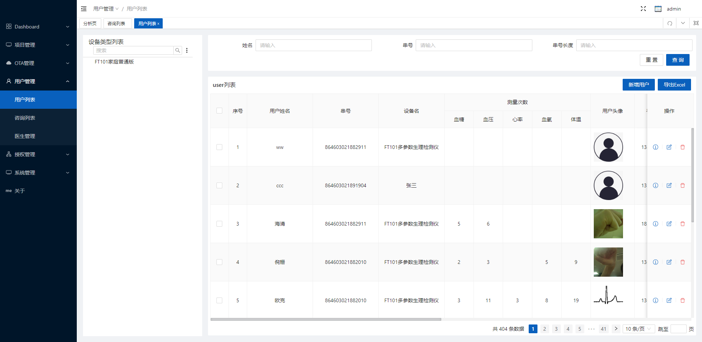
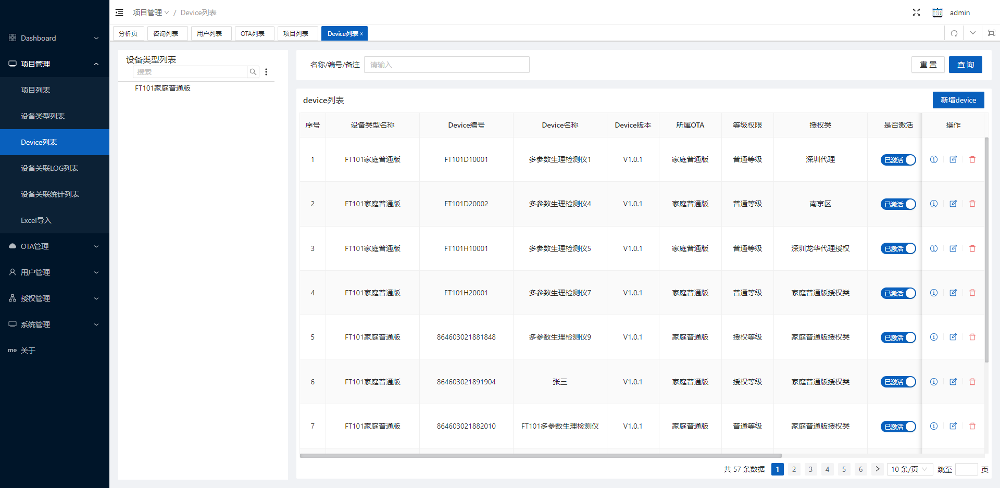
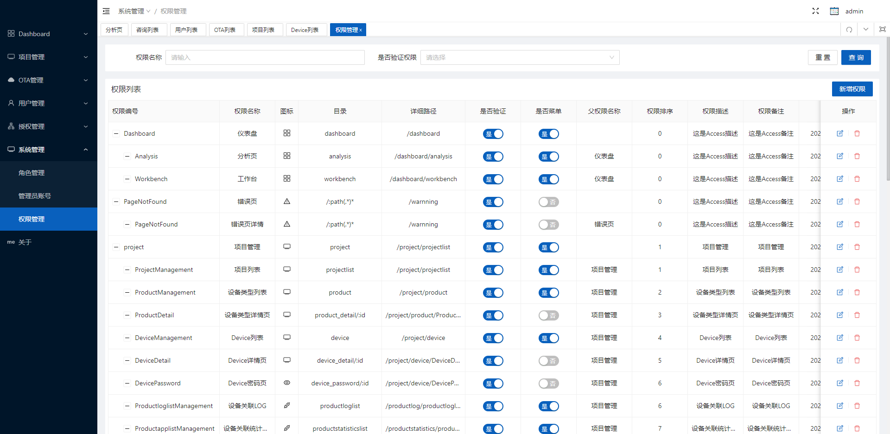

# FastAPI

**中文** | [English](./README.md)

## 版本迭代

+ `V1.1.0` 搭建FastAPI脚手架
+ `V1.2.1` 创建所需的表
+ `V1.2.2` 已成功调试Mysql、Sqlite
+ `V1.2.3` 初始化表数据(调试)
+ `V1.2.4` 优化创建表问题
+ `V1.2.5` 初始化所有表数据
+ `V1.2.6` 封装日志模块
+ `V1.2.7` 封装多进程日志模块(线程锁)
+ `V1.2.8` 优化了目录结构
+ `V1.2.9` 优化代码&&调试了user表的增删查接口
+ `V1.3.0` 添加了防止跨域请求代码&&调试了接口
+ `V1.3.1` 更换了日志模块(loguru)&&添加了后端数据验证
+ `V1.3.2` 更新了所需的包
+ `V1.3.3` 修改了查询单个信息的数据
+ `V1.4.0` 删除了获取所有数据以及获取单个数据的方法
+ `V1.4.1` 修改了校验规则
+ `V1.4.2` 删除了整型和浮点型的正则校验规则
+ `v1.4.3` 尝试部署中。。。
+ `v1.4.4` 部署成功,修复了部分bug
+ `v1.4.5` 测试token
+ `v1.4.6` 调试token成功(admin, 123)
+ `v1.4.7` 重构FastAPI
+ `v1.4.8` 添加redis
+ `v1.4.9` 重构后端 
+ `v1.5.0` 支持图片上传 
+ `v1.5.1` 后台实现权限管理模块
+ `v1.5.2` 大文件上传
+ `v1.5.3` 系统管理：管理员，角色，权限
+ `v1.5.4` 设备用户权限
+ `v1.5.5` 项目管理
+ `v1.5.6` OTA管理
+ `v1.5.7` 用户管理
+ `v1.5.8` 授权管理
+ `v1.5.9` 咨询管理
+ `v1.6.0` 医生管理
+ `v1.6.1` Excel导入，导出

## 安装

1. 配置<font color="red">Python3.9(及以上)</font>的虚拟环境

2. 安装运行所需的包

   ```python
   # 默认装了Mysql与ProgreSQL
   pip install requirements.txt
   
   # 或者
   pip install fastapi
   pip install uvicorn[fastapi]
   pip install loguru
   pip install SQLAlchemy
   pip install aioredis
   pip install python-jose
   pip install passlib
   pip install bcrypt
   pip install python-multipart
   pip install orjson
   pip install xlrd
   pip install python-dateutil
   
   # 使用MySQL, 请安装下面包
   pip install mysqlclient
   
   # 使用ProgreSQL
   pip install psycopg2
   ```


3. 启动服务

    + 进入到 `backend` 项目下
    + 找到 `main.py` 右键运行
    + `core/config` 配置文件(默认数据库是mysql)

   > 接口文档：http://127.0.0.1:9888/docs

## 项目截图

+ 仪表盘

  

+ 用户

  

+ 设备

  

+ 权限

  

## 项目目录

```sh
|-- backend

    |-- api					        # 接口
        |-- admin
            |-- __init__.py       	# 管理员接口       	             	                  
            |-- access.py	        # 权限接口
            |-- accessrole.py	    # 角色关联权限接口
            |-- admin.py	        # 管理员接口
            |-- dashBoard.py	    # 管理员首页    
            |-- dm_user.py	        # 用户接口
            |-- professors.py	    # 医生接口
            |-- role.py	            # 角色接口   
        |-- common                  
            |-- __init__.py       	# 共用接口 
            |-- login.py	        # 登录接口
            |-- redis_check.py	    # 检查redis是否连接成功
            |-- upload.py	        # 图片上传，大文件分片上传
        |-- __init__.py	         
        |-- deps.py	                # 依赖项
        |-- api_router.py	       	# admin接口汇总    
                         
	|-- core					
		|-- __init__.py			# 核心内容   
		|-- config.py			# 配置文件
		|-- security.py		    # 安全配置
	|-- crud
		|-- __init__.py			# 数据库的增删改查操作
		|-- base.py     		# 封装数据库增删改查方法
		|-- xxx.py              # 对应各个表.py
		
 	|-- db					
 		|-- __init__.py			# 初始数据库以及表数据
		|-- data.py		        # 所有数据【曾经想把所有示例写入此文件，最后想想还是算了，直接用mysql导出.sql文件】
    	|-- init_data.py		# 两种初始化表数据的方式
		|-- init_db.py			# 创建和删除base中的表
		|-- session.py			# 创建数据库连接会话
    	|-- redis.py		    # 注册Redis
        
    |-- device					# 接口【参照api文件夹】
        |-- admin               # 各种接口
        |-- common              # 各个工具
    	
    |-- logs                    # 日志模块(自动生成)
        |-- 2021-10-06_23-46-45.log			    
        |-- 2021-10-06_23-46-47.log			    
        |-- 2021-10-06_23-46-49.log		
        	    
	|-- models                  
		|-- __init__.py			# ORM模型映射
		|-- base.py		        # 自动生成 表名
		|-- xxx.py              # 对应各个表.py
		
	|-- register               
	    |-- __init__.py			# 注册中心
	    |-- cors.py			    # 注册跨域请求
	    |-- exception.py		# 注册全局异常
	    |-- middleware.py		# 注册请求响应拦截
	    |-- router.py		    # 注册路由
	    
	|-- schemas 
		|-- __init__.py			# 数据模型
		|-- common.py			# 公用表模型
		|-- result.py			# 返回数据模型
		|-- todo.py			    # 待办模型
		|-- token.py			# token模型
		|-- xxx.py              # 对应各个表.py
		
	|-- utils                   # 工具
	    |-- __init__.py		    # 抛出工具类
	    |-- create_dir.py		# 创建文件夹类(位置勿动)
	    |-- custon_exc.py		# 自定义异常
	    |-- ip_address.py		# 根据ip获取位置
	    |-- logger.py		    # 日志模块
	    |-- permission_assign.py # 权限管理
	    |-- resp_code.py	    # 状态码
	
	|-- __init__.py
	|-- main.py					# 主程序
	|-- gunicorn.py				# gunicorn多进程配置
	|-- Dockerfile              # Dockerfile文件
	|-- README.md               # Readme文件
	|-- requirements.txt		# 所需的包
```

