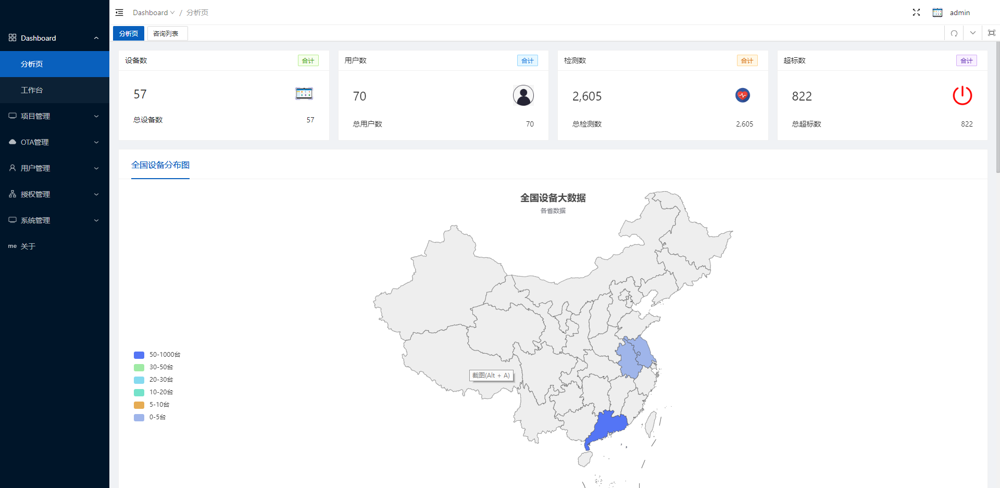
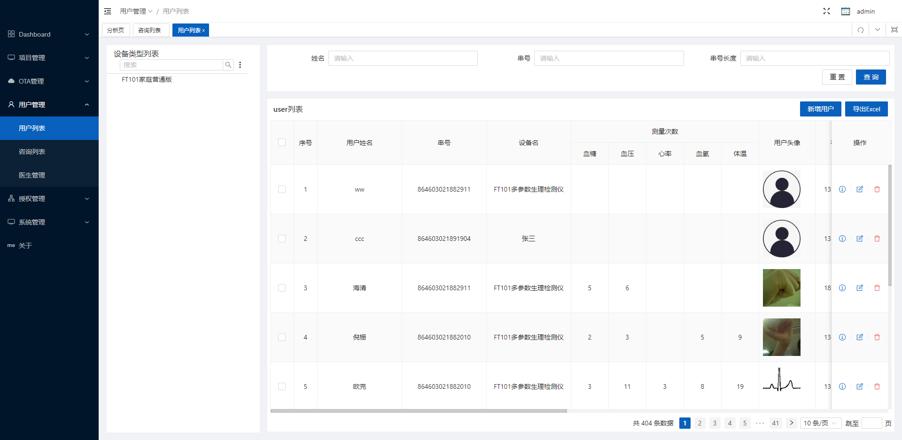
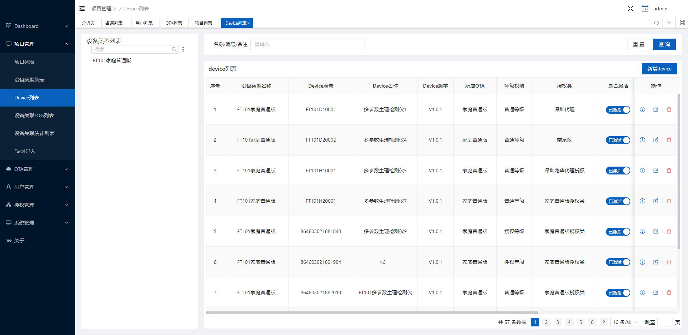
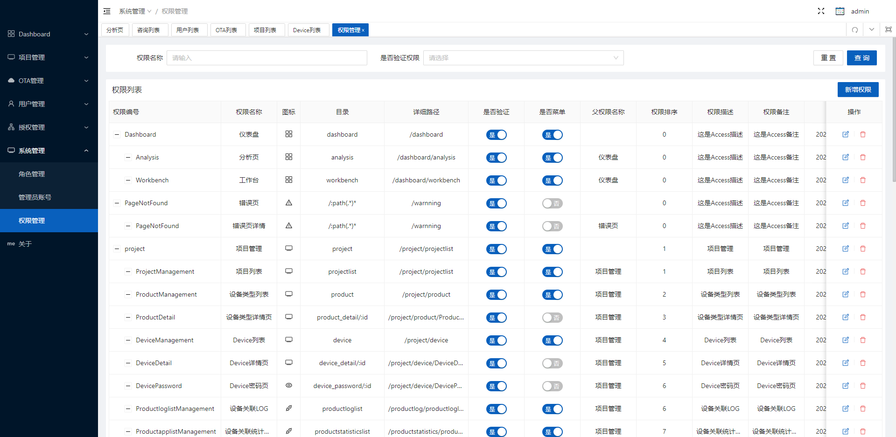

# FastAPI

**English** | [中文](./README_cn.md)

## version

+ `V1.1.0` Build FastAPI scaffold
+ `V1.2.1` Create the required table
+ `V1.2.2` Successfully debugged MySQL and Sqlite
+ `V1.2.3` Initialize table data (debug)
+ `V1.2.4` Optimization table creation problem
+ `V1.2.5` Initialize all table data
+ `V1.2.6` Encapsulate log module
+ `V1.2.7` Encapsulates the multi-process log module (thread lock)
+ `V1.2.8` optimized directory structure
+ `V1.2.9` Optimize the code&&debug the add/delete query interface of the user table
+ `V1.3.0` added code to prevent cross-domain requests&&debugged the interface
+ `V1.3.1` replaced the log module (loguru)&&added back-end data validation
+ `V1.3.2` updated the required package
+ `V1.3.3` modified the data for querying single information
+ `V1.4.0` deleted the method of obtaining all data and single data
+ `V1.4.1` modified the verification rule
+ `V1.4.2` deleted regular verification rules for integer and floating point types
+ `v1.4.3` Attempting to deploy...
+ `v1.4.4` deployment succeeded, and some bugs were fixed
+ `v1.4.5` test token
+ `v1.4.6` debug token succeeded (admin, 123)
+ `v1.4.7` Refactoring FastAPI
+ `v1.4.8` Add redis
+ `v1.4.9` Refactoring backend
+ `v1.5.0` supports image upload
+ `v1.5.1` Background permission management module
+ `v1.5.2` Large file upload
+ `v1.5.3` System management: administrator, role, permission
+ `v1.5.4` Device user permissions
+ `v1.5.5` project management
+ `v1.5.6` OTA management
+ `v1.5.7` User management
+ `v1.5.8` authorization management
+ `v1.5.9` Consulting management
+ `v1.6.0` Doctor management
+ `v1.6.1` Excel import, export

## install

1. install<font color="red">Python3.9(or up level)</font>

2. install package

   ```python
   # Mysql or ProgreSQL
   pip install requirements.txt
   
   # or
   pip install fastapi
   pip install uvicorn[fastapi]
   pip install loguru
   pip install SQLAlchemy
   pip install aioredis
   pip install python-jose
   pip install passlib
   pip install bcrypt
   pip install python-multipart
   pip install orjson
   pip install xlrd
   pip install python-dateutil
   
   # MySQL for python
   pip install mysqlclient
   
   # ProgreSQL for python
   pip install psycopg2
   ```
	mysql database back file is ft101.sql

3. start service

    + goto `backend` folder
    + run `main.py` 
    + `core/config` setting file

   > Interface document：http://127.0.0.1:9888/docs

## picture

+ doshboard

  

+ user

  

+ device

  

+ permissions

  
## file system

```sh
|-- backend

    |-- api					        # Interface
        |-- admin
            |-- __init__.py       	# admin interface folder      	             	                  
            |-- access.py	        # permissions 
            |-- accessrole.py	    # Role association permissions 
            |-- admin.py	        # admin
            |-- dashBoard.py	    # dashBoard    
            |-- dm_user.py	        # user
            |-- professors.py	    # professors
            |-- role.py	            # role   
        |-- common                  
            |-- __init__.py       	# public 
            |-- login.py	        # login
            |-- redis_check.py	    # redis_check
            |-- upload.py	        # upload file
        |-- __init__.py	         
        |-- deps.py	                # Dependencies
        |-- api_router.py	       	# router file    
                         
	|-- core					
		|-- __init__.py			# Core  
		|-- config.py			# settings
		|-- security.py		    # security
	|-- crud
		|-- __init__.py			# database operation 
		|-- base.py     		# base operation
		|-- xxx.py              # tables.py
		
 	|-- db					
 		|-- __init__.py			# database's table data
		|-- data.py		        # some table data sql(too many datas,so i give up and export from navicate tools soft)
    	|-- init_data.py		# init data
		|-- init_db.py			# create and drop all tables.
		|-- session.py			# connection to database for session
    	|-- redis.py		    # Redis
        
    |-- device					# device interface
        |-- admin               # interface folder
        |-- common              # public
    	
    |-- logs                    # log folder
        |-- 2021-10-06_23-46-45.log			    
        |-- 2021-10-06_23-46-47.log			    
        |-- 2021-10-06_23-46-49.log		
        	    
	|-- models                  
		|-- __init__.py			# ORM models
		|-- base.py		        # base model
		|-- xxx.py              # table model.py
		
	|-- register               
	    |-- __init__.py			# register
	    |-- cors.py			    # Cross-domain
	    |-- exception.py		# abnormal exception
	    |-- middleware.py		# middleware
	    |-- router.py		    # router
	    
	|-- schemas 
		|-- __init__.py			# schemas
		|-- common.py			# common
		|-- result.py			# result
		|-- todo.py			    # to do
		|-- token.py			# token
		|-- xxx.py              # schemas table.py
		
	|-- utils                   # utils
	    |-- __init__.py		    # utils
	    |-- create_dir.py		# create_dir
	    |-- custon_exc.py		# customer_exc
	    |-- ip_address.py		# ip address
	    |-- logger.py		    # logger
	    |-- permission_assign.py # permission assign
	    |-- resp_code.py	    # response_code
	
	|-- __init__.py
	|-- main.py					# main
	|-- gunicorn.py				# gunicorn setting
	|-- Dockerfile              # Dockerfile
	|-- README.md               # Readme
	|-- requirements.txt		# requirements
```

